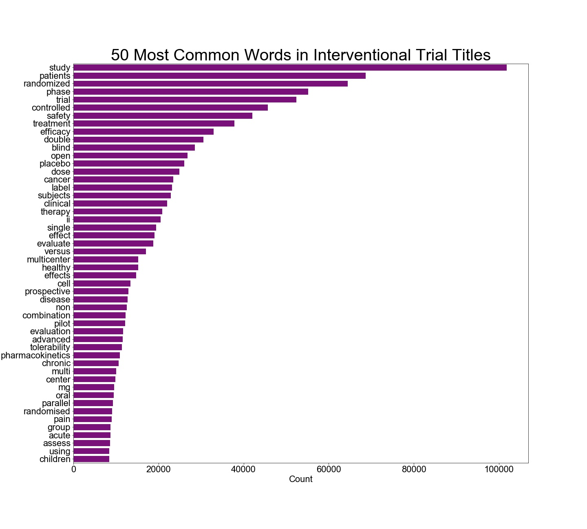
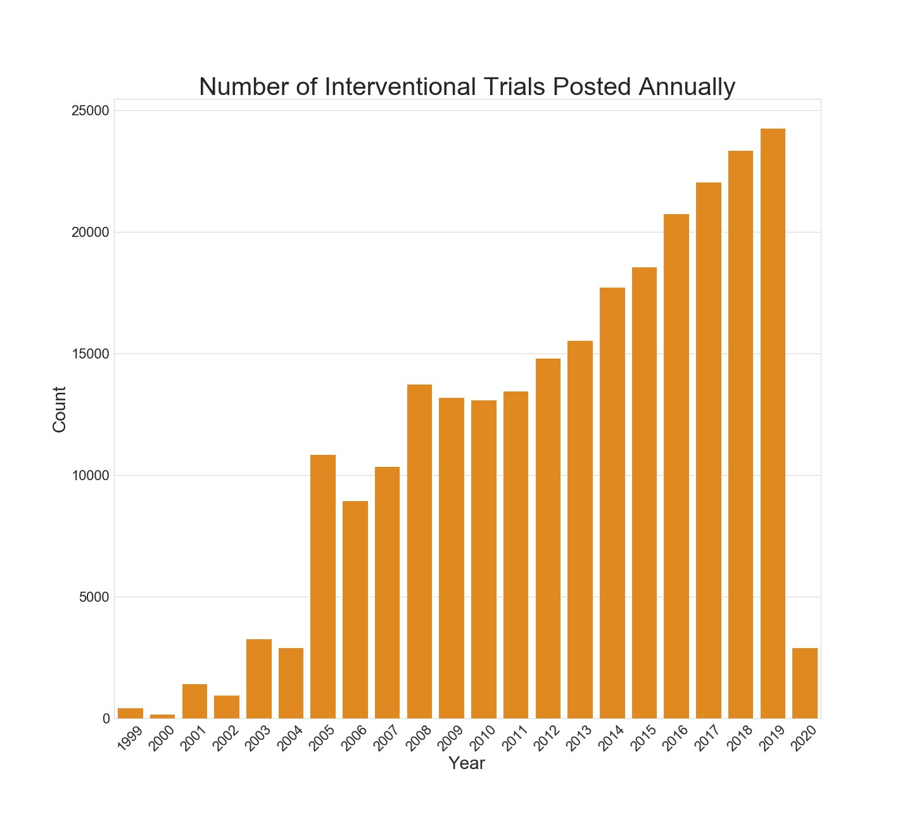
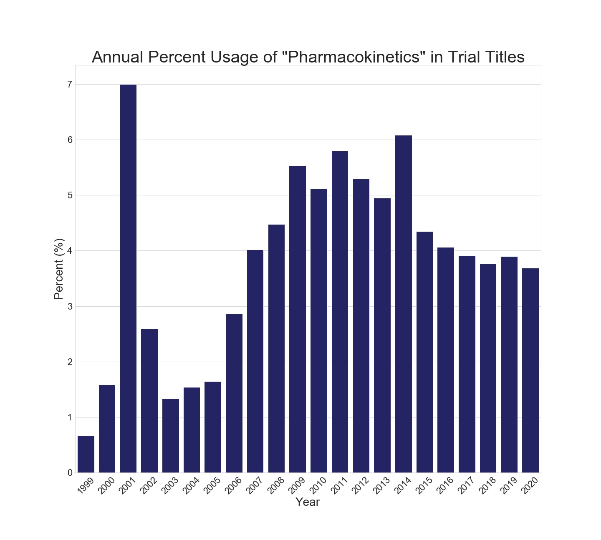
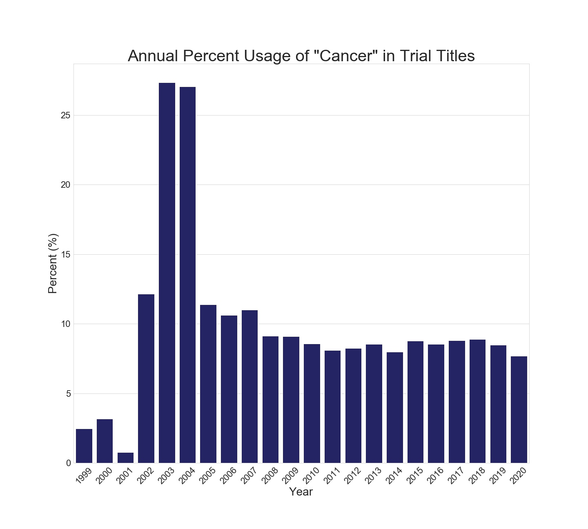
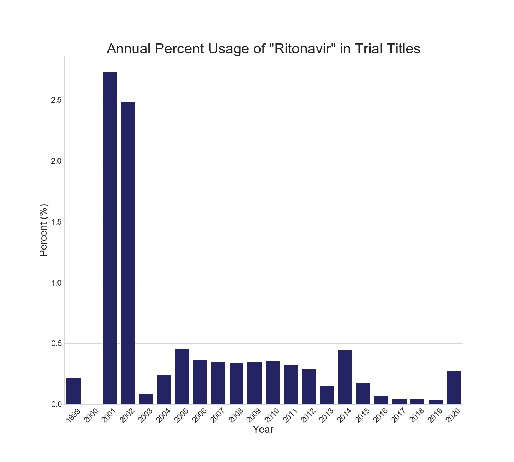

# ClinicalTrials.gov
### Lisa Hwang

### Objective
For this project, I examined a dataset from [ClinicalTrials.gov](https://clinicaltrials.gov) consisting of all of their public study records. I did not have a specific problem that I wanted to answer going in, but the dataset seemed rich and worth exploring. During the time working on this project, I formed two goals:
 1. To use time series analysis to identify common words in study titles and how often they occur.
 2. To use models to predict whether a study title is for an interventional or observational study.

### Repository Structure
- README
- [Data](data/): Folder containing dataset.
- [Images](images/): Folder containing data visualizations.
- [Notebook 1](1_DataCleaning.ipynb): This Jupyter Notebook outlines the process of assembling the JSON study records into a CSV.
- [Notebook 2](2_TimeSeries.ipynb): This notebook describes time series analyses performed on the data.
- [Notebook 3:](3_Modeling.ipynb) This notebook details two models for predicting study type from trial titles.

### Background
ClinicalTrials.gov is a website that was created by the National Institutes of Health's (NIH's) National Library of Medicine (NLM) and was made public on February 29, 2000. It was created in response to the Food and Drug Administration Modernization Act of 1997 (FDAMA) and originally primarily focused on NIH-funded studies. At present, ClinicalTrials.gov serves as a database to store information for interventional and non-interventional studies both in the United States and abroad. Records are submitted by study teams and then approved by ClinicalTrials.gov's reviewers to be made public.

Reference: [https://clinicaltrials.gov/ct2/about-site/history](https://clinicaltrials.gov/ct2/about-site/history)

Here are definitions for the types of studies housed in ClinicalTrials.gov:

Interventional study:
- "A type of clinical study in which participants are assigned to groups that receive one or more intervention/treatment (or no intervention) so that researchers can evaluate the effects of the interventions on biomedical or health-related outcomes. The assignments are determined by the study's protocol. Participants may receive diagnostic, therapeutic, or other types of interventions."

Observational study:
- "A type of clinical study in which participants are identified as belonging to study groups and are assessed for biomedical or health outcomes. Participants may receive diagnostic, therapeutic, or other types of interventions, but the investigator does not assign participants to a specific interventions/treatment. A patient registry is a type of observational study."

Expanded access:
- "A way for patients with serious diseases or conditions who cannot participate in a clinical trial to gain access to a medical product that has not been approved by the U.S. Food and Drug Administration (FDA). Also called compassionate use. There are different expanded access types."

Reference: [https://clinicaltrials.gov/ct2/about-studies/glossary](https://clinicaltrials.gov/ct2/about-studies/glossary)

Since ClinicalTrials.gov records do not have consistent numerical data across all studies, I elected to focus on textual data, particularly words in study titles.

### Dataset
The entire dataset was downloaded from ClinicalTrials.gov through their API at [https://clinicaltrials.gov/api/gui](https://clinicaltrials.gov/api/gui). As of February 11, 2020, the total number of records in the database was 329,957. The records were in JSON format which were challenging to handle due to my limited experience with JSON files. The files were stored in 427 folders, separated by the first four digits of their record number (example: "NCT0000xxxx"). The hardest aspect of the project might simply have been figuring out how to extract all of the records and combining them into one dictionary. Once the code was sorted, it took approximately 30 minutes for all the JSON files to be compiled into one.

Due to size of the data, it was suggested to initially work with a smaller dataset for efficiency and then the entire dataset later on. I chose to start with one folder, NCT0426xxxx, which held 575 records. This proved to be a wise strategy since manipulations were able to be executed much faster. I started by creating and modifying code for this smaller dataset.

### EDA
During the EDA process, small issues would pop up and need to be troubleshooted. For example, the function to extract the study type from each of the NCT0426xxxx trial records would stop running after the 229th record. Closer investigation revealed that the [particular record](https://clinicaltrials.gov/ct2/show/NCT04263532) had been redacted as it was a trial of a device not FDA-approved or cleared, and thus there was no study type in the record. The code then had to be modified to insert a NaN for that record so that the row could be deleted later.

Another issue was that there was only one study with a study type of expanded access in the NCT0426xxxx dataset. This study had to be removed from the dataset in order to proceed with modeling.

I originally wanted to use the study start date for time series, but I found out that this might not be the best idea. Study start dates used to be in month year format, but recently ClinicalTrials.gov switched to requiring the actual day in addition to month and year. For uniformity with the dates, I decided to use the date the study record passed editorial review which every record would have.

Once the data were to my liking, a dataset was exported as a CSV which could be imported into additional notebooks for modeling and analyses.

### Time Series
####  To use time series analysis to examine common words in study titles and how often they occur
Both observational and expanded access studies were removed from the dataset, leaving 253,069 interventional trials. CountVectorizer was then run on the titles, dates were converted to years for the time series.

First, I examined the most commonly used words in titles.

Then I reviewed the number of interventional trial records that were published each year.

I also picked a few words to review for presence over the years. Since counts of words were showing misleading trends, I elected to present percentages of occurrence of words divided by number of annual trials.

A fascinating finding is a jump in the usage of "ritonavir" for the first two months of 2020. Ritonavir, an antiretroviral medication for those with HIV/AIDS, may hold promise as a treatment for the novel coronavirus COVID-19, and clinical trials are currently underway.

### Modeling
#### To use models to predict whether a study title is for an interventional or observational study
For modeling, both the interventional and observational studies were kept in the dataset; again the expanded access studies were removed. Interventional studies totaled 253,069 and observational 65,297. CountVectorizer was used to split up and count the words in the study titles, and train/test split and standard scaler were applied to the data.

The first model was a logistic regression. Since there were approximately 79% interventional trials in the dataset, a model with better accuracy than 79% was desired. This was accomplished, with a test score of 0.8763.

|Train score  |Test score  |
|--|--|
|0.8848|0.8763|

Here is a confusion matrix of the results.

|  | predicted observational |predicted interventional|
|--|--|--
|**actual observational**  |7835  |5225
|**actual interventional**  |2654  |47960

Next, neural networks were employed to see if they could improve on logistic regression's accuracy of 0.8763. Keras was used to set up the networks. The neural networks were unable to noticeably improve on the logistic regression predictor model.

| Parameters |Train score  |Test score  |
|--|--|--|
|1 hidden layer, 1024 units, 10 epochs, batch size of 512|0.9936  | 0.8680|
|1 hidden layer, 18 units, 5 epochs, batch size of 512|0.9147  |0.8683|
|2 hidden layers, 18 units, 5 epochs, batch size of 512|0.9165  |0.8671|

### Challenges
Manipulating the dataset was the primary challenge. I was working with JSON files which were less familiar to me. Though it took some time, I was able to handle the files successfully. Unexpected issues with the data were also roadblocks, as well as the amount of time to run certain analyses on the entire dataset being substantial at times.

### Future Directions
The ClinicalTrials.gov records are such a rich dataset with many possible analyses that could be done. I would like to perform K-Means clustering on the study title words, though I was informed that performing principal component analysis (PCA) prior to clustering could be useful due to the sheer size of the data.

I might also try continuing to adjusting the CountVectorizer, logistic regression, and neural network parameters to improve accuracy. Further research into why certain titles were incorrectly predicted would be something to spend additional time on as well.

Also, gathering the data for all of 2020 at the beginning of 2021 would be a nice way to round out the dataset and review how the common the identified words were at the end of 2020. With the COVID-19 pandemic currently occurring, I would be curious to see what other drugs for this novel coronavirus would be studied in clinical trials this year.
